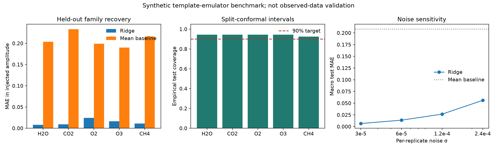
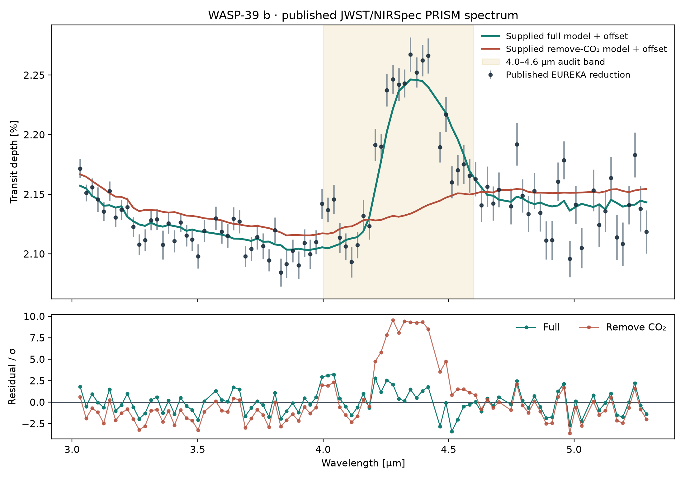

# CosmicML-Biodetect

An explicitly synthetic benchmark for asking a limited inverse-problem
question: **can a regularized linear model recover five injected molecular
feature amplitudes from a declared analytic spectral emulator?**

This repository does **not** currently demonstrate biosignature detection in
JWST, HST, Keck, or any other observed spectrum. It does not estimate a
probability of life. The legacy neural-network and retrieval modules remain
experimental prototypes; placeholder loaders and samplers are not part of the
validated benchmark.

## Reproduced benchmark

The fixed-seed experiment generates 360 latent atmosphere families. Four noise
realizations are averaged within each family, then families—not individual
realizations—are assigned to four disjoint partitions:

| Partition | Families | Purpose |
|---|---:|---|
| Train | 180 | Fit ridge coefficients |
| Tune | 72 | Select regularization strength |
| Calibration | 54 | Calibrate 90% split-conformal intervals |
| Test | 54 | Final metrics only |

At the prespecified per-replicate noise scale of `6e-5`, the held-out macro MAE
is **0.01375** in injected amplitude units. The training-mean baseline gives
**0.20846**, and the permuted-label negative control gives **0.22352**. The
empirical test coverage of the nominal 90% intervals is **0.9407**. These
numbers measure recovery from the same analytic template family used to create
the data; they are not evidence of observed-data validity.



Machine-readable artifacts:

- [`synthetic_benchmark.json`](results/synthetic_benchmark.json)
- [`species_metrics.csv`](results/species_metrics.csv)
- [`noise_sensitivity.csv`](results/noise_sensitivity.csv)
- [`MODEL_CARD.md`](MODEL_CARD.md)

## Published JWST spectrum audit

A separate, deliberately descriptive audit uses the published WASP-39 b
JWST/NIRSpec PRISM transmission spectrum and the full and “remove CO2”
ScCHIMERA curves deposited by the JWST Transiting Exoplanet Community Early
Release Science Team at
[Zenodo (10.5281/zenodo.6959427)](https://doi.org/10.5281/zenodo.6959427).
Exact archive entries and LF-normalized file hashes are recorded in
[`data/real/SOURCE.md`](data/real/SOURCE.md).

After fitting one weighted vertical offset per supplied model, 93 common bins
give chi-squared values of **179.19** for the full curve and **953.59** for the
remove-CO2 curve, a descriptive difference of **774.40**. The 4.0–4.6 μm
region contributes **680.87** of that difference. Eight contiguous-block
deletions leave differences from **37.19** to **779.09**, making the wavelength
dependence visible rather than hiding it behind one aggregate number.



This is a reproduction check on one publication-supplied data/model pair. It
is **not** a new atmospheric retrieval, a likelihood-ratio detection
significance, or evidence that the synthetic ridge benchmark works on JWST
observations. Machine-readable outputs are
[`wasp39b_real_spectrum_summary.json`](results/wasp39b_real_spectrum_summary.json)
and [`wasp39b_block_deletions.csv`](results/wasp39b_block_deletions.csv).

## Scientific design

1. Five normalized analytic feature templates represent H2O, CO2, O2, O3,
   and CH4 bands over 0.5–5.0 μm.
2. Each latent family has injected amplitudes, a nuisance continuum, and four
   independent Gaussian-noise realizations.
3. Replicates are averaged before splitting, preventing the same latent
   atmosphere from appearing in multiple partitions.
4. Ridge regularization is selected on the tune partition.
5. The model is refit on train+tune. The untouched calibration partition sets
   finite-sample conformal half-widths; the test partition is used once.
6. Mean-prediction and permuted-label controls test whether the model extracts
   more information than class prevalence or accidental fitting.
7. A four-level noise sweep reports sensitivity rather than one preferred
   operating point.

The generator is intentionally simple and inspectable. It is not a line-by-
line radiative-transfer model: the injected targets are dimensionless template
amplitudes, not retrieved volume-mixing ratios.

## Run it

```bash
python -m pip install -r requirements-benchmark.txt
python scripts/run_synthetic_benchmark.py
python scripts/analyze_wasp39b_real_spectrum.py
python -m pytest -q tests/test_benchmark.py --no-cov
```

The synthetic script overwrites its four declared files in `results/`; the
WASP-39 b audit overwrites its three declared outputs. With the same dependency
family and seeds, reruns are deterministic.

## Repository status

| Area | Status |
|---|---|
| Synthetic template benchmark | Validated and reproduced in CI |
| Family-level leakage control | Implemented |
| Negative control | Implemented |
| Split-conformal intervals | Implemented for emulator-distribution coverage |
| Noise sensitivity | Implemented at four declared scales |
| Published WASP-39 b audit | Reproduced from DOI-pinned text products |
| Neural-network/PINN modules | Experimental, not benchmarked here |
| Bayesian retrieval | Placeholder; not a functioning MCMC analysis |
| JWST loader/systematics model | Placeholder; not validated on mission data |
| Biosignature or life detection | Not supported |

The checkpoint files from the original prototype were removed from the current
tree because they lacked a reconstructable dataset split, environment lock,
training log, and independent evaluation record. They remain recoverable from
Git history.

## Scope for a future observational study

Moving beyond this emulator would require, at minimum:

- traceable instrument products and target-level train/test isolation;
- a validated forward model with line-list, opacity, cloud, stellar-contamination,
  and instrument-systematics provenance;
- explicit detection hypotheses and non-biological alternative models;
- simulation-based calibration and coverage checks under model misspecification;
- comparison with established retrieval codes and blinded injections;
- no “biosignature” conclusion from one molecule or one model posterior.

## Citation

This is research software in active development, not a peer-reviewed detection
paper. If you reuse the benchmark, cite the repository and an immutable release:

```bibtex
@software{jana_cosmicml_biodetect_2026,
  author  = {Biswajit Jana},
  title   = {CosmicML-Biodetect: Synthetic Spectral-Amplitude Recovery Benchmark},
  year    = {2026},
  url     = {https://github.com/Biswajit1999/cosmicml-biodetect}
}
```

## License

MIT. See [`LICENSE`](LICENSE).
